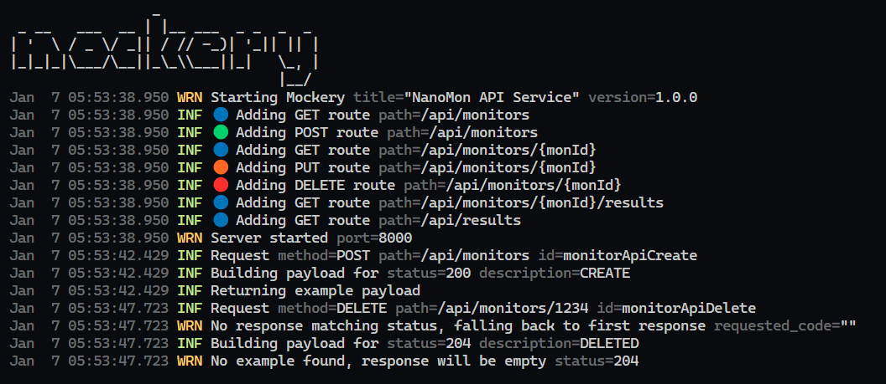

# 🎭 Mockery

Mockery is a tool which takes a Open API Specification (OAS) and runs a HTTP API listener to accept requests based on the spec. It will parse the provided OAS document and discover paths, responses etc and configure handlers to respond accordingly. Currently it supports v2 of Swagger/OAS.

It can be use to act as mock or placeholder server for testing, mocking, or other uses cases when the real API endpoint is not available.

It goes beyond providing simple empty HTTP responses, and will use any examples discovered in the OAS to provide a payload repsonse back, obviously these responses are static, however they do increase the usefulness of the API tremendously.



# 💾 Install & Run

## Download Binary

Binaries are available as GitHub releases https://github.com/benc-uk/mockery/releases/latest

Quick download on Linux

```bash
wget https://github.com/benc-uk/mockery/releases/download/0.0.1/mockery-linux -O mockery
chmod +x ./mockery
```

## Run From Container

A container image is available on GitHub. You will need to mount ot inject the directory where your OAS spec file is located and supply that as an arguement when running, for example:

```bash
docker run -v ./some_directory:/specs \
 -p 8000:8000 \
 ghcr.io/benc-uk/mockery:latest -f /specs/nanomon.json
```

## Go Install 

Install from source if you have Go on your machine

```bash
go install github.com/benc-uk/mockery/cmd@latest
mv $(go env GOPATH)/bin/cmd ~/.local/bin/mockery
```

# 🧩 Usage

```text
$ mockery
  -f string
        OpenAPI spec file in JSON or YAML format. REQUIRED
  -file string
        OpenAPI spec file in JSON or YAML format. REQUIRED
  -log-level string
        Log level: debug, info, warn, error (default "info")
  -port int
        Port to run mock server on (default 8000)
```

You must provide an OpenAPI spec file with either `-file` or `-f`. By default it will start and listen on port 8000

# Response Handling Logic

The OAS spec is parsed and used with the following logic:

- Routes are taken from the `paths` section, with matching operations, e.g. `GET` & `POST` etc. And a matching handler created for each path and method.
- Path parameters enclosed in `{}` like `/api/orders/{orderId}` are matched as part of the route.
- The `responses` section is scanned for a response status code, 200 is the default
  - If 200 is not a present in responses, then the first response in the list is used. 
  - To get a different response/status supply the `x-mock-response-code` header on the request.
- To create a payload for the response, the selected response object is used as follows:
  - If the response has an `examples` field the `application/json` key is used & returned.
  - Otherwise if the response has a `schema` and this schema has an `example` it is used & returned.
  - Otherwise if the response has a `schema` it is parsed and traversed, the fields `properties`, `items` are used and `$ref` can reference models from the `definitions` section of the spec.
    - If no `example` are found at the field level, a fallback default value for the type is used, e.g. `"string"` or `0` or `false`

## Developer Guide

Pre-reqs

- Go v1.21+
- Linux/bash/make

Makefile is the frontend

```text
help                 💬 This help message :)
install-tools        🔮 Install dev tools into project .tools directory
lint                 🔍 Lint & format check only, sets exit code on error for CI
lint-fix             📝 Lint & format, attempts to fix errors & modify code
image                📦 Build container image from Dockerfile
push                 📤 Push container image to registry
build                🔨 Build binaries for all platforms
run                  🏃 Test and hotreload the app
clean                🧹 Clean up, remove dev data and files
release              🚀 Release a new version on GitHub
```
